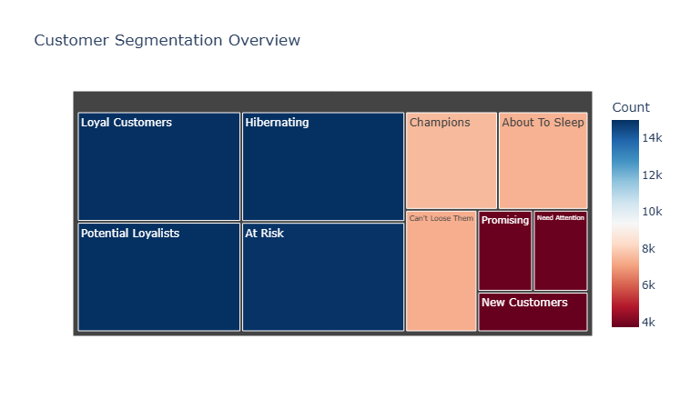
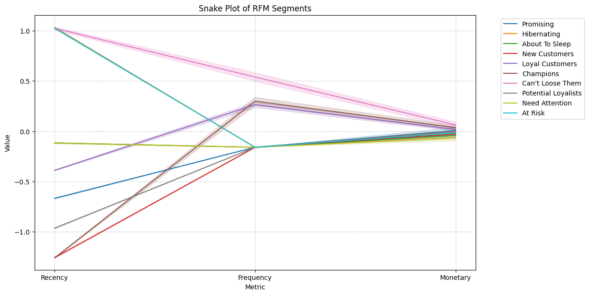
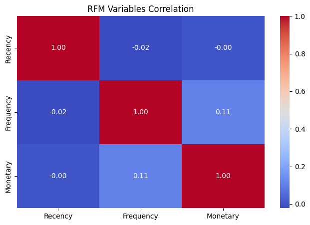

# Olist E-Commerce Customer Segmentation & Interactive Dashboard
.png)
*Interactive Streamlit Dashboard Overview*

This project provides a comprehensive analysis of customer behavior using the **Olist Brazilian E-Commerce Dataset**. By leveraging **RFM (Recency, Frequency, Monetary)** analysis, I segmented over 93,000 unique customers into actionable categories and built an interactive dashboard to visualize business insights.

## Project Journey
The analysis is divided into five critical phases:
1. **Data Preprocessing:** Merging multiple datasets and cleaning 100k+ records.
2. **RFM Modeling:** Calculating Recency, Frequency, and Monetary values for every unique customer.
3. **Customer Segmentation:** Using quintile-based scoring to assign segments (e.g., Champions, Loyal, At Risk).

*Hierarchical view of customer segments*
4. **Advanced Visualizations:** Creating Heatmaps, Treemaps, and Snake Plots to understand segment behavior.

*Standardized behavior patterns across RFM metrics*
5. **Interactive Dashboard:** Developed a real-time dashboard using **Streamlit** for business stakeholders.

## Tech Stack
- **Language:** Python 3.13
- **Data Analysis:** Pandas, NumPy
- **Visualization:** Matplotlib, Seaborn, Plotly
- **Dashboard Framework:** Streamlit
- **Environment:** VS Code / Jupyter Notebook

## Key Features
- **Behavioral Analysis:** Snake plots reveal that while "Champions" are highly active, a large portion of the base is "At Risk," requiring urgent retention strategies.
- **Independence of Metrics:** Correlation heatmaps confirmed that R, F, and M are independent drivers of customer value in this dataset.

*Heatmap showing the independence of Recency, Frequency, and Monetary values*
- **Dynamic Dashboard:** Filter segments in real-time to see KPI metrics like Total Revenue, Average Recency, and Segment Volume.

## Key Business Insights
- **The Retention Challenge:** The Loyal Customers and At Risk segments are nearly equal in size, indicating that for every loyal customer gained, one is potentially being lost.
- **Low Repeat Purchase Rate:** Over 90% of customers have made only a single purchase. The primary business growth opportunity lies in converting one-time shoppers into repeat buyers.
- **Metric Independence:** A near-zero correlation between Recency, Frequency, and Monetary values proves that high spending does not guarantee loyalty. A multi-dimensional RFM approach is essential for this dataset.
- **Champion Efficiency:** The Champions segment (approx. 7.5k customers) consistently outperforms all others across all three metrics. Prioritizing VIP rewards for this group will yield the highest ROI.
- **Revenue Concentration:** A small percentage of top-tier segments generates a disproportionately large share of total revenue, highlighting the importance of targeted high-value marketing.

## How to Run the Dashboard
1. Clone the repository.
2. Install dependencies:  
   `pip install pandas plotly streamlit seaborn`
3. Generate the data file from the notebook:  
   `rfm.to_csv('rfm_data.csv')`
4. Run the dashboard:  
   `streamlit run app.py`

## Dataset Reference
The data is sourced from the [Olist Brazilian E-Commerce Dataset](https://www.kaggle.com/datasets/olistbr/brazilian-ecommerce) on Kaggle.

---